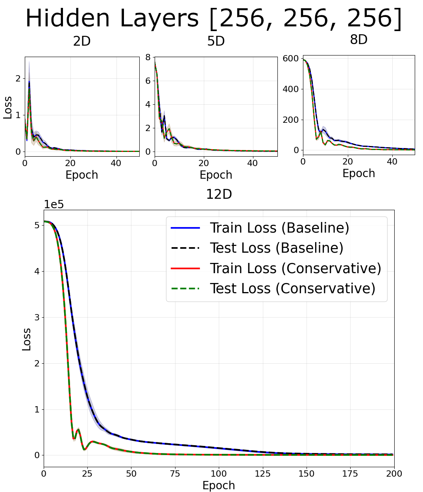

<h1 align='center'> Do Conservative PINNs Train Faster In High Dimensions?
    [<a href="https://rfangit.github.io/blog/2025/conservative_pinns/">Blog Post</a> ]</h1>

**NOTE**: Still in progress! All the code + results are here, but I will be cleaning up this readme and the file structure a little over this week.

Code repository + results for experiments on a neural network with a built-in bias to produce conservative vector fields. The purpose of these experiments was to determine if such neural networks will train faster than a baseline neural network thanks to their inductive bias.

Unlike past results, these experiments focus on the regime where the dimension of the problem is very high, and we find small improvements in the training speed compared to the baseline for problems with dimension $d \geq 8$.

The code in this repository allows anyone to replicate the experiments, generating data corresponding to a toy vector field prediction problem as well as training the related networks.

----

## Table of Contents

- **dataset_gen.py** : Functions for generating datasets
- **model.py** : Neural network models (baseline network + conservative network)
- **train.py** : Functions for training neural network models.
- **Experiments (Conservative Fields)**: Code and results for experiments with conservative vector fields in a variety of experimental regimes and network architectures
- **Experiments (Non-conservative Fields)**: Code and results for experiments with non-conservative vector fields to show results obtained are due to the built-in conservative vector field bias.
- **figs**: Code for generating figures, as well as finished figures.

### Organization of Experiments

The experiment folders are named according to {Experimental Regime}{Network Hidden Layers}, where eg. dense corresponds to the underlying vector field formed from a dense region of Gaussian centers, and 64 64 64 corresponds to 3 hidden layers of 64 neurons.

Inside each folder are several folders and notebooks

- **consolidated images**: plots of the loss curves
- **consolidated text files**: raw data for generating curves
- **datasets**: data for the vector field
- **DataPlot.ipynb**: example on plotting data from the text files
- **Experiments.ipynb**: code for training a baseline and conservative network on the data. **Does not run unless you first run Generate_Dataset.**
- **Generate_Dataset.ipynb**: code for generating the underlying vector field, and then sampling at $10000$ points to produce training and test data. **The underlying vector fields are in this repostiroy, but the $10000$ train/test points were not included due to space reasons.**

For nonconservative experiments, an additional parameter is used in **Generate_Dataset.ipynb** which multiplies the vector field by a linear transformation beforehand, destroying the conservative property. An example of how this works is included in **Nonconservative Transformation Example.ipynb**.

### Figs

On top of code to generate the figures, there also exists code to compute the actual computational time cost of conservative networks and the ratio of losses per epoch.